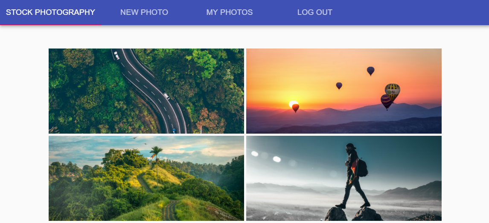
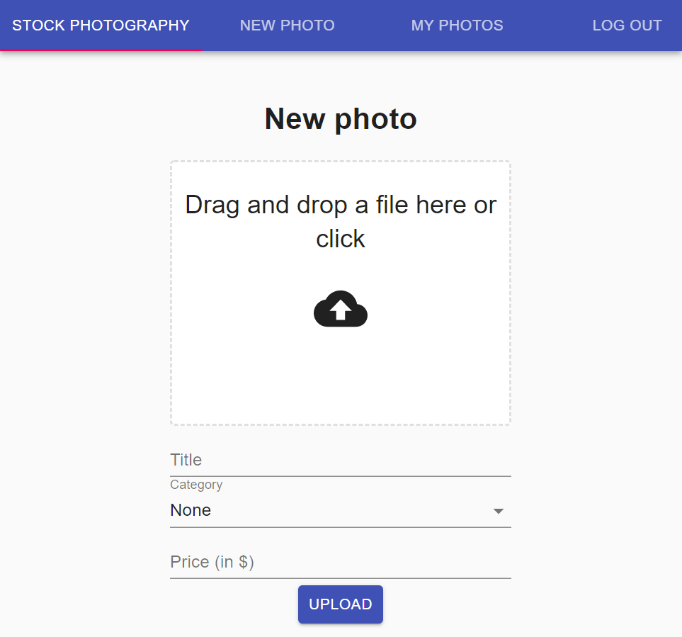
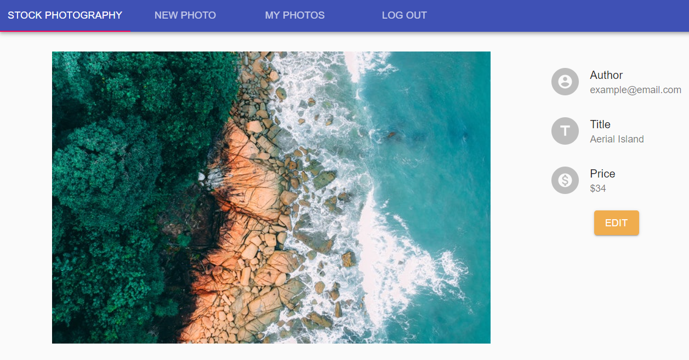
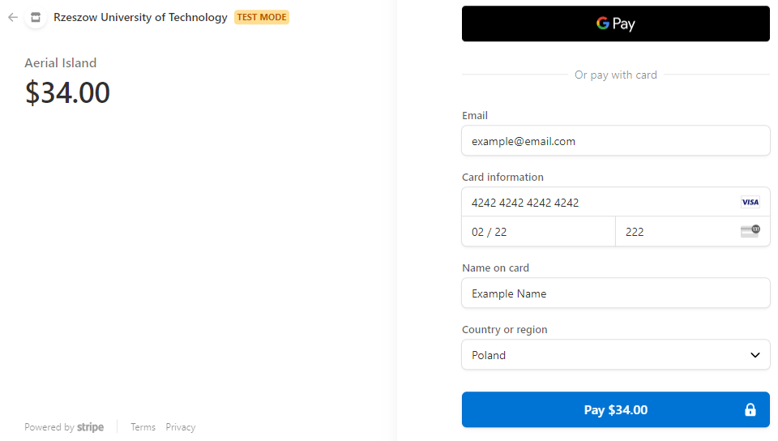

# stock-photography-shop
👉 https://stock-photography-shop.netlify.app 👈
## Description
Online shop with stock photographies. Fullstack RESTful CRUD app. It uses AWS S3 Service for photo storing and Stripe for payments.

# Backend
- AWS S3 integration ✅
- Stripe integration ✅
- Express.js ✅
- MongoDB ✅
- TypeScript ✅
- passport (authorization) ✅
- pino, morgan (logging) ✅

# Frontend
- React ✅
- Redux ✅

# Screenshots





## Requirements for running the app:
1. Clone repo
2. Install node.js
3. Install mongoDB
4. Start backend server (PORT 8080):
```
$ cd backend
$ npm install
$ npm run dev
```
5. Start frontend server (PORT 3000):
```
$ cd frontend
$ npm install
$ npm start
```
6. Go to http://localhost:3000
